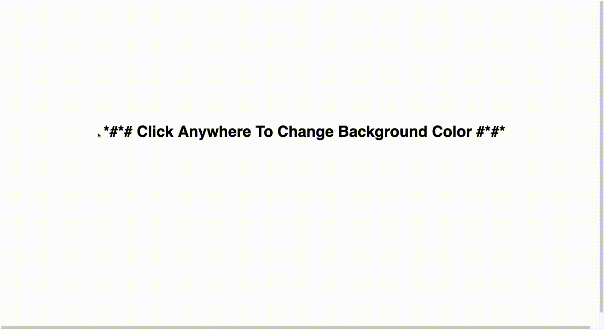

# Random Color Generator P5.JS

- Random 3 argument RGB(x,y,z) on mouse click

- Previous RGB is stored to be displayed on screen in previous section

- text()
- textAlign()
- textSize()
- textStyle()
- random()
- mouseClicked()

;